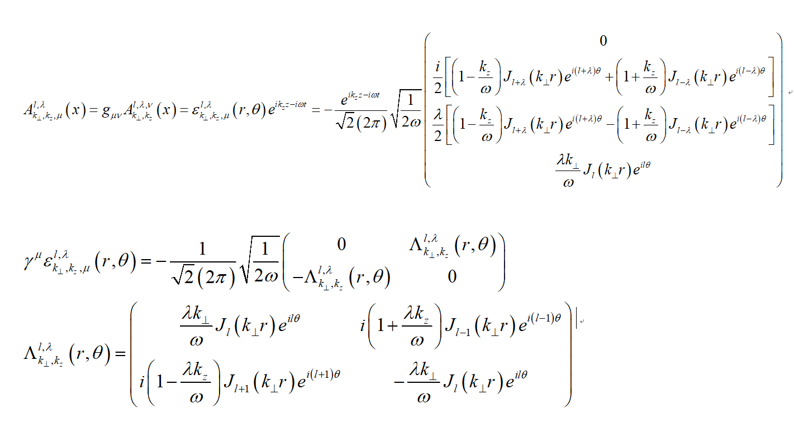

# December
Change the matlab program into c++

### 12/15
- [x] Check the program, whether the positron and electron are in the same channel, whether there is a mistake in the energy and momentum.
    
        one mistake: I put omega^3 in the last. The index is wrong.   
        The Energy algorithm is changed, let it be 0 when it's less than 0;

- [x] Check the derivation of procedure in the beginning of definitions of functions;
- [x] Read 《Selected Works of Mao Zedong》 for one chapter
- [x] Plant trees for at least 12 quantifiers.
- [x] Learn c++ for at least one hour.
- [x] Take oral english and writing english classes.

### 12/16
- [x] Check the program of energy and momentum step by step.
- [x] Go on the derivation without expansion.

        Understand Flourier transformation, T with $\nu$ time region to frequency 
        region. x to p, x space to p space
        To learn more about Flourier transformation
        
**It seems that the B,C iterms have something wrong while the A,D can get the same probability.**

- [x] Plant trees for at least 12 quantifiers.
- [x] Exercise for two hours.
- [x] Learn new melody at least one episode.
- [x] Learn C++ for at least one hour.

### 12/17
- [x] Give the speech in the morning and afternoon, the quantum field theory introduction.
- [x] Learn C++ for at least one hour, review the struct and srand;
  I'm so tired today, turn this to tomorrow.
- [ ] Go on check the derivation;
- [x] plant trees at least 12 quantifiers;
- [x] Calculate the 0101 cross-section.

### 12/18
- [x] Go on check the derivation;
- [ ] Learn c++ for at least one hour;
        I just learned for half an hour, since in Friday I listen to classic music of 巴赫 and Mozart;
- [x] Exercise for two hour;
- [x] Read 《selected works of maozedong》
- [x] Plant at least for 12 trees;
- [x] Listennig to cello suite No.1 in G major;
- [x] Air on the G string;
- [x] Piano Sonata No.8 in C minor,Op 13 悲怆奏鸣曲

### 12/19
- [x] Change complex number into real number in the program;
- [ ] Read 《Selected works of maozedong》 for a chapter;
- [x] Write your Wechat eassy;
- [x] Listen to 《D小调安魂弥撒曲》;

### 12/20
- [x] 打听激光加工相关的消息
- [ ] Find out the difference
- [x] Exercise for two hours

### 12/21
- [x] Read english for an hour
- [x] Read an article everyday, just title and abstruct;
- [x] Take the english class afternoon;
- [ ] Learn Magic tube 3 and upload a task; Learn how to use super computer;
- [x] Learn C++ for two hours;
- [ ] Learn why there is a mistake;
- [ ] Learn about spacevim;

### 12/22
:joy: 
- [x] Summarize the evidence for my program;
- [ ] Learn Compton scattering and the functions of photons and electrons;
- [ ] Use geant4 to caculate the polarization of electrons and positrons;
- [ ] Plant trees for at least 12 quantifiers;;
- [ ] Learn C++ for at least 2 hours;
- [ ] Read an article, only abstract is ok;
- [x] Take the oral english class and writing class;
- [x] Listen to a piece of  classical sound;

### 12/23
:blush:
- [ ] Plant 12 trees;
- [x] Learn Compton scattering and the functions of photons and electrons;
- [x] Use geant4 to calculate the polarization;
- [x] Exercise for two hours;
- [ ] Learn C++ for two hours;
- [x] Learn an article, only abstract is ok;
- [x] Listen to a new classic song;

### 12/24 silent night
- [x] Listen to songs about silent night;
- [x] Draw the pictures of every channel's tendency
- [x] Read an article
- [x] Go to see the doctor
- [ ] Plant at least 12 trees
- [x] Review the song of tuerqi 
- [ ] Learn C++ for at least two hours

### 12/25
"We may encounter many defeats but we must not be defeated."
- [x] Amend the derivation;
- [ ] Plant at least 12 trees;
- [ ] Take part in science popularization work;
I forget it;
- [x] Exercise for two hours;
- [ ] Learn C++ for two hours;
- [x] Listen to a classic song;
- [x] Practice Turkish March.

### 12/26
:star:

- [ ] Single program of python;
- [ ] Read an article;
- [ ] Learn the function;
- [x] Plant 6 tres;
- [x] Learn how to insert picture in markdown;
- [ ] PPT slide change;

### 12/27 
:heart_eyes:  Make the most of yourself, for that is all there is of you.
- [x] Learn how to use notion;
- [ ] Read Feynman physics;
- [x] Draw the pictures;
- [x] Modify the English wirting assigment;

## 12/28~12/31
- [ ] Learn circular polarization light to twisted pairs;
- [ ] English learning;

### 12/28
:smile: "Nothing is impossible, the word itself says 'I'm possible!'"
- [x] Finish the english work;
- [ ] Change the color of the picture;
- [ ] Review the music Tuerqi;
- [x] Calculate the averaged spin value;
- [x] Watch the New Year's party;

### 12/29
:wink: "Excuses are the rocks where our dreams are crushed."
- [x] Prepare for the oral test;
- [x] Check the program;
- [ ] Go on the derivation;
- [ ] Listen to the concert of Golden chime;

### 12/30
:blush: "Being happy doesn't mean that everything is perfect. It meas that you decided to look beyond the imperfections."
- [x] Go on the derivation;
- [x] Read an article;
- [ ] Listen to a classic song;
- [ ] Plant at least 12 trees;
- [ ] Draw the pictures of average spin.
- [ ] Draw the Intensity profile of a Bessel beam $I_{\perp}$.

### 12/31
:kissing_heart: "Today I will do what others won't, so tomorrow I can do what others can't."
- [x] Draw the pictures of average spin.
- [x] Check the first term;
- [ ] Read three articles;
- [ ] Talk to teacher;
- [ ] Plant at least 8 trees;
- [x] The OAM distance may comes from the momentum difference;
- [ ] To show  that the plane-wave photon has the same quality that the distribution of positrons and electrons are different;

